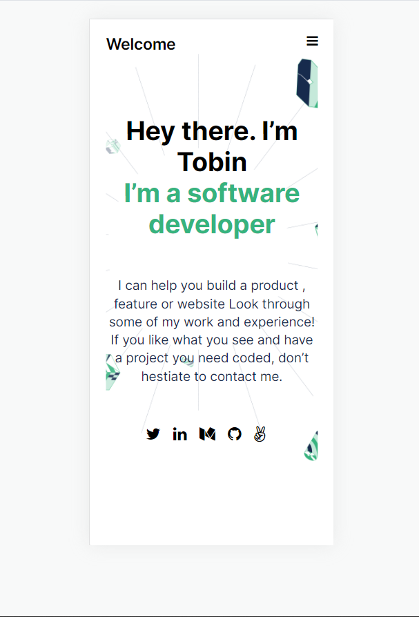

# Portfolio

> This is my portfolio website showcasing my work as a web developer

## Live Demo
[Click here](https://tobinchilongo.github.io/Portfolio-Setup/)

Additional description about the project and its features.

## Built With

- HTML
- CSS

To get a local copy up and running follow these simple example steps.

### Prerequisites
- Flexbox
- Linters
- Figma
- GitHub Flow

### Install
git clone https://github.com/Tobinchilongo/Portfolio-Setup
cd Portfolio-Setup

## Authors

👤 Tobin Chilongo Jnr

- GitHub: [@Tobinchilongo](https://github.com/Tobinchilongo)
- Twitter: [@Tobin_Official](https://twitter.com/Tobin_Official)
- LinkedIn: [@Tobin Chilongo](https://www.linkedin.com/in/tobin-chilongo-a6736415a/)

## 🤝 Contributing

Contributions, issues, and feature requests are welcome!

## Show your support

Give a ⭐️ if you like this project!

## Acknowledgments

- W3schools for references
- MDN Documentation for references and research

## 📝 License

This project is [MIT](./MIT.md) licensed.
